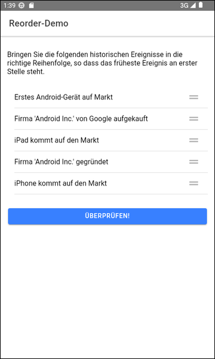
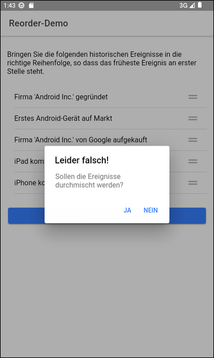

# Reorder Demo #

 

Simple [Ionic](https://ionicframework.com/) app with Angular that demonstrates the 
usage of the UI component [ion-reorder](https://ionicframework.com/docs/api/reorder).

 

----

## Screenshots ##

 

 &nbsp; 

 

----

## License ##

 

See the [LICENSE file](LICENSE.md) for license rights and limitations (BSD 3-Clause License) for the files in this repository.

 