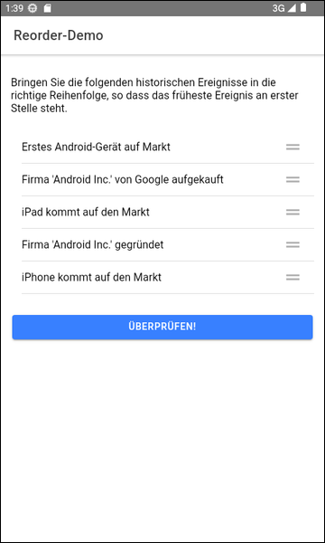
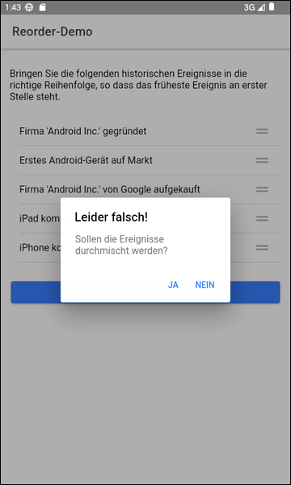

# Ionic: Reorder:Demo #

 

Einfache [Ionic](https://ionicframework.com/)-App mit Angular, die die Verwendung der UI-Komponente [ion-reorder](https://ionicframework.com/docs/api/reorder) demonstriert.

 

----

## Screenshots ##

 

 &nbsp; 

 

----

## License ##

 

See the [LICENSE file](LICENSE.md) for license rights and limitations (BSD 3-Clause License) for the files in this repository.

 
